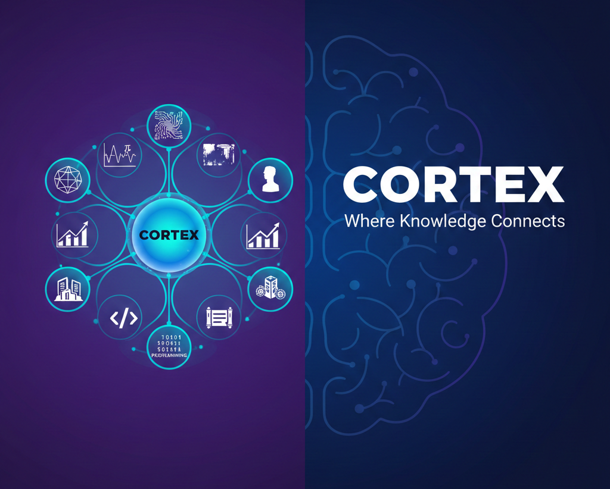

<div align="center">

# Cortex 🧠  
**Multi-Disciplinary Knowledge Acquisition Engine**

[](https://www.python.org/)
[](LICENSE)
[](CONTRIBUTING.md)
[](https://github.com/AridsWolfgang/Cortex)



**Your personal bridge to interdisciplinary understanding**  
Cortex is not just a chatbot — it's a **knowledge synthesizer** that helps you explore, connect, and deeply acquire insight across 8 fundamental domains of human thought.

</div>

## 🌐 The Vision

In a world of hyper-specialization, the most powerful breakthroughs occur at the **intersections** of disciplines.  
Cortex exists to:

- Surface hidden connections  
- Accelerate conceptual understanding  
- Turn passive reading into active, joyful discovery  
- Help you build richer, more integrated mental models

### Currently Active Domains

| Domain                  | Core Focus Areas                                      | Example Intersection                             |
|-------------------------|-------------------------------------------------------|--------------------------------------------------|
| **Mathematics**         | Logic · Calculus · Probability · Topology            | Fibonacci → Renaissance proportion → Algorithms  |
| **Economics**           | Incentives · Markets · Game theory · Macroeconomics   | Behavioral econ → Historical revolutions         |
| **Business**            | Strategy · Innovation · Operations · Leadership       | SWOT → Military history → Modern startups        |
| **Finance**             | Valuation · Risk · Derivatives · Portfolio theory     | Stochastic calculus → Black-Scholes → Physics    |
| **Programming**         | Algorithms · Paradigms · Systems · Software craft     | Recursion → Art fractals → Nature patterns       |
| **History**             | Civilizations · Ideas · Power · Culture               | Enlightenment → Scientific method → Engineering  |
| **Art**                 | Aesthetics · Technique · Movements · Symbolism        | Perspective math → Renaissance → Computer graphics|
| **Electrical Engineering** | Circuits · Signals · Electromagnetism · Control     | Information theory → Economics of networks       |

## ✨ Key Differentiators (Knowledge-Centric)

- **Cross-domain synthesis** — never just answers, always **connections**  
- **"Aha!" engineered responses** — designed to spark insight  
- **Progressive depth** — from intuition → formalism → application  
- **Contextual memory** — builds on previous exchanges like a real tutor  
- **Curated learning paths** — guided journeys across disciplines  
- **Active learning modes** — quizzes, Socratic dialogue, problem sets

## 🏗️ Architecture at a Glance

```text
                ┌───────────────────────────────┐
                │     User Interface Layer      │
                │   • CLI • Web • Voice • API   │
                └───────────────┬───────────────┘
                                │
                    ┌───────────▼───────────┐
                    │  Intelligent Router    │
                    │  • Semantic classification│
                    │  • Context tracking      │
                    │  • Multi-domain routing  │
                    └───────────┬───────────────┘
                                │
          ┌─────────────────────┼─────────────────────┐
   ┌────────────┐       ┌────────────┐       ┌────────────┐
   │ Mathematics│       │  Finance   │       │   History  │  …and more
   └────────────┘       └────────────┘       └────────────┘
          │                    │                    │
   ┌────────────┐       ┌────────────┐       ┌────────────┐
   │  Concepts  │       │   Models   │       │  Narratives│
   │  Theorems  │       │  Formulas  │       │   Events   │
   └────────────┘       └────────────┘       └────────────┘
```

## 🚀 Quick Start – Start Acquiring Knowledge Today

```bash
# 1. Clone & enter directory
git clone https://github.com/AridsWolfgang/Cortex.git
cd Cortex

# 2. Virtual environment (strongly recommended)
python -m venv venv
source venv/bin/activate    # Windows: venv\Scripts\activate

# 3. Install (currently minimal – growing fast)
pip install -r requirements.txt

# 4. Launch the knowledge engine
python src/main.py
```

Then just ask:

- "Show me how compound interest relates to exponential growth in biology"  
- "Walk me through RSA encryption — from number theory to real-world impact"  
- "Connect Ohm's law to information flow in economic networks"

## 🎓 Curated Learning Journeys (Examples)

1. **Math → Art → Programming**  
   Golden ratio → Renaissance composition → Procedural generation  

2. **History → Economics → Finance**  
   Tulip mania → Speculative bubbles → Modern derivatives crashes  

3. **Physics → EE → Programming**  
   Maxwell → Signal processing → Digital communications  

Want to suggest or build a new path? → See [CONTRIBUTING.md](CONTRIBUTING.md)

## 🛤️ Roadmap – Building a True Knowledge Companion

- **Phase 1 – Foundation** (Current)  
  ✓ Modular architecture  
  ✓ Keyword + rule-based routing  
  ✓ Wikipedia fallback + hard-coded insights  
  ✓ Basic context memory  

- **Phase 2 – Intelligence Layer** (Next)  
  - spaCy / transformers-based classification  
  - RAG (Retrieval-Augmented Generation) over rich KB  
  - Adaptive difficulty & personalization  

- **Phase 3 – Full Experience**  
  - Voice input/output  
  - Visual explanations (diagrams, generated art)  
  - Real-time data feeds (markets, news, arXiv)  
  - Multi-user collaborative sessions  

## 🤝 How You Can Help Build the Knowledge Graph

This project is **designed for learners who want to teach while learning**.

Top impact areas right now:

- Expand domain knowledge bases (JSON or Python modules)  
- Add beautiful cross-domain insight snippets  
- Create interactive learning modules / quizzes  
- Improve router precision (add examples!)  
- Design visual explainers for tricky concepts  
- Port to web / Discord / Telegram  

→ Read [CONTRIBUTING.md](CONTRIBUTING.md) for guidelines

## 📜 License

MIT — free to learn, free to share, free to build upon.

## 🌟 Final Thought

> “The mind that opens to a new idea never returns to its original size.”  
> — Oliver Wendell Holmes Jr.

Cortex aims to be the tool that keeps opening minds — one fascinating connection at a time.

<div align="center">

**[⭐ Star Cortex](https://github.com/AridsWolfgang/Cortex)** if you're excited about interdisciplinary knowledge!  
Questions? Ideas? → [Open a discussion](https://github.com/AridsWolfgang/Cortex/discussions)

</div>
```